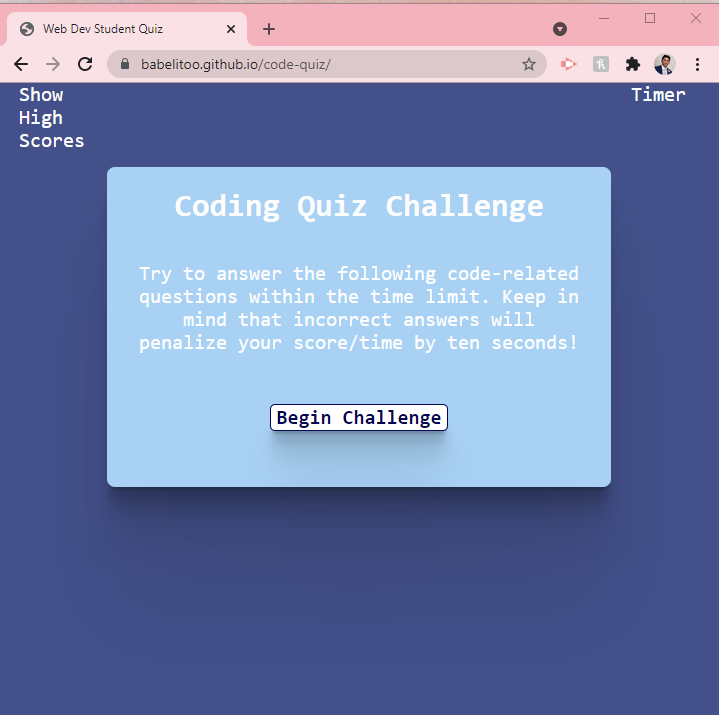

# Code-Quiz

## Description

A Java Script built app where users have 60 seconds to complete a 5 question quiz. For every incorrect answer, they will recieve a 10 second deduction. Once the timer reaches zero seconds or all five questions are completed, the quiz will automatically end. Youll then be prompted to write your initials and save your high score and view it.

### Live Deployment

https://babelitoo.github.io/code-quiz/

## Demo Pic:

## Table of Contents

- [Installation](#installation)
- [Usage](#usage)
- [License](#license)

## Installation

N/A

## Usage

_Instructions for use:_
N/A

## License

Open

### Questions?

For any questions, please contact me with the information below:

GitHub: [@babelitoo](https://github.com/babelitoo)
